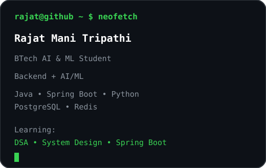

<h3><code>rajat@github ~ $ ./contributions.sh</code></h3>

  

<table>
<tr>

<td width="45%" align="center">

</td>

<td width="55%" align="center">

</td>

</tr>
</table>

  

<h3><code>rajat@github ~ $ connect</code></h3>

<a href="https://github.com/RajatMani35">GitHub</a>
&nbsp; • &nbsp;
<a href="https://leetcode.com/u/RajatMani/">LeetCode</a>
&nbsp; • &nbsp;
<a href="https://www.linkedin.com/in/rajat-tripathi-663b27312/">LinkedIn</a>

